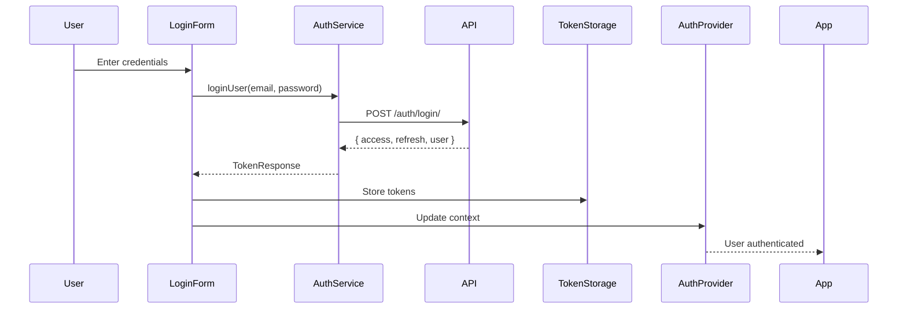
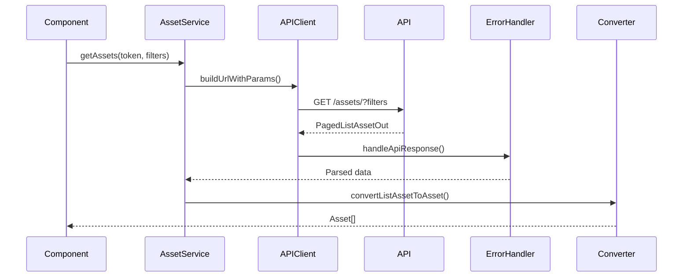
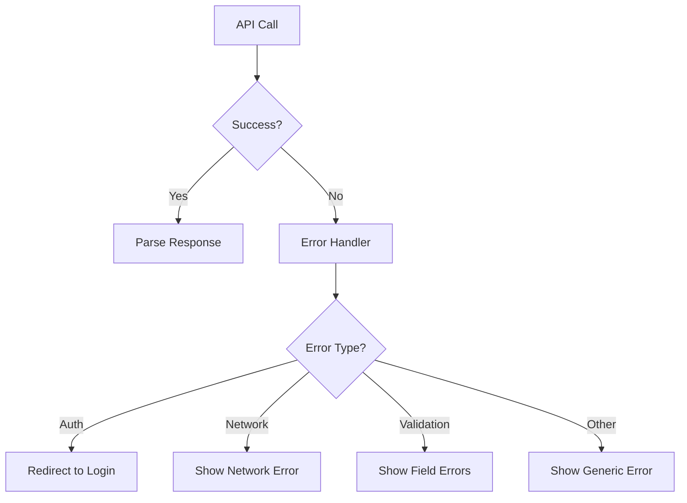

# Architecture Overview

This document provides a high-level overview of the Itqan CMS architecture, design decisions, and key patterns.

## 📋 Table of Contents

- [Technology Stack](#technology-stack)
- [Project Structure](#project-structure)
- [Core Concepts](#core-concepts)
- [Data Flow](#data-flow)
- [Design Patterns](#design-patterns)
- [Security](#security)

## 🛠️ Technology Stack

### Frontend Framework
- **Next.js 15:** React framework with App Router
- **React 19:** UI library with latest features
- **TypeScript 5:** Type-safe JavaScript

### Styling
- **Tailwind CSS 4:** Utility-first CSS framework
- **CSS Logical Properties:** RTL/LTR support
- **shadcn/ui:** Accessible component library

### Internationalization
- **next-intl:** i18n routing and translations
- **Locale Support:** Arabic (RTL) and English (LTR)

### State Management
- **React Context:** Global state (auth, theme)
- **Local State:** Component-level state with hooks

### HTTP Client
- **Native Fetch API:** Modern browser API
- **Custom Wrappers:** Centralized error handling

## 📁 Project Structure

### Layered Architecture

```
┌─────────────────────────────────────┐
│         Presentation Layer           │
│  (Components, Pages, UI)             │
├─────────────────────────────────────┤
│         Application Layer            │
│  (Hooks, Providers, State)           │
├─────────────────────────────────────┤
│         Domain Layer                 │
│  (Models, Business Logic)            │
├─────────────────────────────────────┤
│         Infrastructure Layer         │
│  (API Client, Services, Utils)       │
└─────────────────────────────────────┘
```

### Directory Structure

```
src/
├── app/                    # Presentation Layer
│   └── [locale]/          # Internationalized routes
│
├── components/            # Presentation Layer
│   ├── ui/               # Base UI components
│   ├── providers/        # React context providers
│   └── [feature]/        # Feature-specific components
│
├── lib/                  # Infrastructure & Domain Layers
│   ├── api/             # Infrastructure: API communication
│   │   ├── client/      # HTTP client utilities
│   │   └── services/    # API service functions
│   ├── types/           # Domain: Type definitions
│   │   ├── api/         # API contracts
│   │   └── models/      # Domain models
│   └── utils/           # Infrastructure: Utilities
│
├── hooks/               # Application Layer
└── messages/            # i18n translations
```

## 🎯 Core Concepts

### 1. Internationalization First

Every aspect of the app is designed for multilingual support:

- **Routing:** `/[locale]/` prefix for all routes
- **Content:** All text through translation dictionaries
- **Layout:** CSS logical properties for RTL/LTR
- **Assets:** Localized content and metadata

### 2. Type Safety

Strong typing throughout the application:

- **API Types:** Contracts with backend
- **Domain Models:** Internal representations
- **Component Props:** Fully typed interfaces
- **Utility Functions:** Type-safe helpers

### 3. Component Composition

Reusable, composable components:

- **Base Components:** shadcn/ui primitives
- **Feature Components:** Domain-specific logic
- **Layout Components:** Structure and navigation
- **Provider Components:** Context and state

### 4. Separation of Concerns

Clear boundaries between layers:

- **Presentation:** What users see
- **Application:** How users interact
- **Domain:** Business rules
- **Infrastructure:** External services

## 🔄 Data Flow

### Authentication Flow



### Asset Fetching Flow



### Error Handling Flow



## 🎨 Design Patterns

### 1. Service Layer Pattern

Centralized API communication:

```typescript
// Service function
export async function getAssets(
  token?: string,
  filters?: AssetListFilters
): Promise<PagedListAssetOut> {
  const url = buildUrlWithParams('/assets/', filters);
  return apiGet<PagedListAssetOut>(url, token);
}

// Usage in component
const assets = await getAssets(token, { category: ['mushaf'] });
```

### 2. Repository Pattern

Data access abstraction:

```typescript
// API types → Domain models conversion
export function convertListAssetToAsset(
  listAsset: ListAssetOut
): Asset {
  return {
    id: listAsset.id.toString(),
    title: listAsset.name,
    // ... mapping logic
  };
}
```

### 3. Provider Pattern

Global state management:

```typescript
// Auth Provider
export function AuthProvider({ children }: AuthProviderProps) {
  const [user, setUser] = useState<User | null>(null);
  
  const login = async (email: string, password: string) => {
    // Login logic
  };
  
  return (
    <AuthContext.Provider value={{ user, login, logout }}>
      {children}
    </AuthContext.Provider>
  );
}
```

### 4. Custom Hooks Pattern

Reusable logic extraction:

```typescript
// Custom form hook
export function useForm<T>({
  initialData,
  validate,
  onSubmit
}: UseFormOptions<T>) {
  const [formData, setFormData] = useState<T>(initialData);
  // Form state management logic
  
  return {
    formData,
    errors,
    handleInputChange,
    handleSubmit
  };
}
```

### 5. Barrel Export Pattern

Simplified imports:

```typescript
// lib/types/index.ts
export type { UserProfileSchema } from './api/auth.types';
export type { Asset, AssetDetails } from './models/asset.model';

// Usage
import type { UserProfileSchema, Asset } from '@/lib/types';
```

## 🔒 Security

### Authentication

- **JWT Tokens:** Access and refresh tokens
- **Secure Storage:** localStorage for client-side
- **Token Refresh:** Automatic refresh before expiry
- **Logout:** Server-side token invalidation

### API Security

- **Authentication Headers:** Bearer token in Authorization
- **HTTPS Only:** Encrypted communication
- **CSRF Protection:** State parameter in OAuth
- **Input Validation:** Client and server-side

### Security Headers

```typescript
// middleware.ts
response.headers.set('X-Content-Type-Options', 'nosniff');
response.headers.set('X-Frame-Options', 'DENY');
response.headers.set('X-XSS-Protection', '1; mode=block');
```

## 🌍 Internationalization Architecture

### Routing Strategy

```
URL Structure:
/{locale}/{path}

Examples:
/ar/store          → Arabic store
/en/store          → English store
/ar/auth/login     → Arabic login
```

### Translation Loading

```typescript
// Server Components
const dict = await getDictionary(locale);

// Client Components
const t = useTranslations();
const text = t('key.path');
```

### RTL/LTR Handling

```typescript
// Automatic direction based on locale
<html dir={direction} lang={locale}>

// CSS Logical Properties
className={cn(
  logical.paddingStart('4'),  // ps-4 (auto RTL/LTR)
  logical.textStart            // text-start (auto RTL/LTR)
)}
```

## 📊 Performance Optimizations

### Code Splitting

- **Route-based:** Automatic by Next.js App Router
- **Component-based:** Dynamic imports for heavy components
- **Library-based:** Optimized package imports

### Caching Strategy

- **Next.js:** Static generation and ISR
- **Browser:** Service workers (future)
- **API:** Response caching (backend)

### Bundle Optimization

- **Tree Shaking:** Unused code elimination
- **Minification:** Production builds
- **Compression:** Gzip/Brotli

## 🔄 State Management

### Global State

```
AuthProvider → User authentication state
ThemeProvider → Dark/light theme
LocaleProvider → Current language
```

### Local State

```
useState → Component state
useForm → Form state management
useAsync → Async operation state
```

## 🧪 Testing Strategy

### Testing Pyramid

```
       /\
      /E2E\          End-to-end tests
     /______\
    /        \       Integration tests
   /Integration\
  /______________\
 /                \  Unit tests
/      Unit        \
```

### Test Types

- **Unit Tests:** Pure functions, utilities
- **Component Tests:** UI components
- **Integration Tests:** Feature flows
- **E2E Tests:** Critical user journeys

## 🚀 Deployment

### Build Process

```bash
1. npm run type-check   # TypeScript validation
2. npm run lint         # Code quality check
3. npm run build        # Production build
4. npm run start        # Start server
```

### Environment Configuration

```
Development  → .env.local
Staging      → Netlify environment variables
Production   → Netlify environment variables
```

## 📈 Scalability Considerations

### Horizontal Scaling

- **Stateless Design:** No server-side sessions
- **CDN Distribution:** Static assets
- **API Load Balancing:** Multiple backend instances

### Performance Scaling

- **Lazy Loading:** Components and routes
- **Pagination:** Large data sets
- **Virtualization:** Long lists
- **Debouncing:** Search and filters

## 🔗 Related Documentation

- [Development Guidelines](../GUIDELINES.md)
- [API Integration Guide](./API.md)
- [Contributing Guide](../CONTRIBUTING.md)

