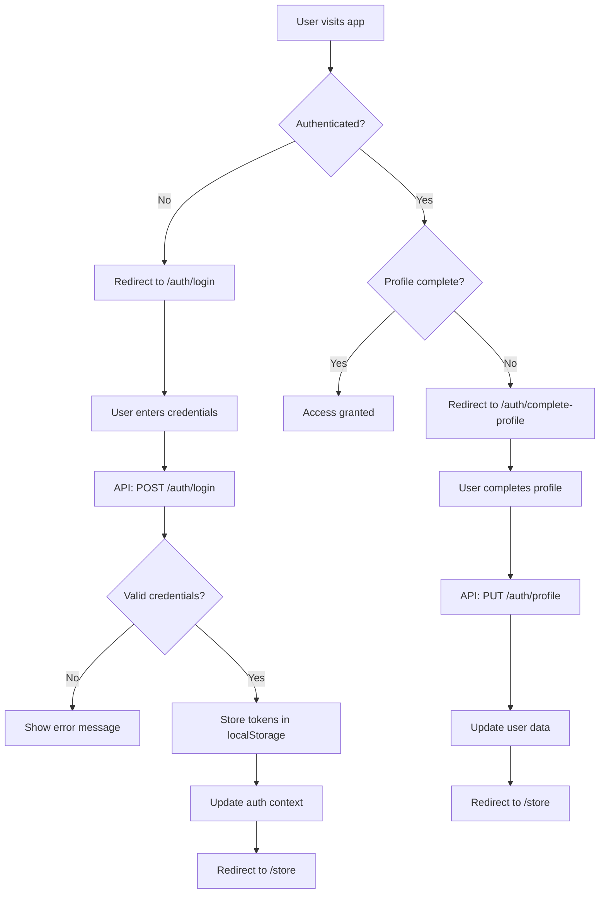

# Itqan CMS Architecture Documentation

**Version**: 1.0  
**Last Updated**: October 20, 2025  
**Project**: Itqan CMS (Next.js 15 + TypeScript + ShadCN)

---

## 📋 Table of Contents

1. [System Overview](#system-overview)
2. [Technology Stack](#technology-stack)
3. [Application Architecture](#application-architecture)
4. [Data Flow](#data-flow)
5. [Component Hierarchy](#component-hierarchy)
6. [State Management](#state-management)
7. [Authentication Flow](#authentication-flow)
8. [Internationalization](#internationalization)
9. [Styling Architecture](#styling-architecture)
10. [API Integration](#api-integration)
11. [Performance Considerations](#performance-considerations)
12. [Security Architecture](#security-architecture)

---

## System Overview

Itqan CMS is a modern, multilingual content management system built for managing and distributing Islamic digital assets. The system provides a comprehensive platform for publishers to share content and users to discover, access, and download digital resources.

### Core Features

- **Multilingual Support**: Native Arabic (RTL) and English (LTR) with automatic layout direction
- **Asset Management**: Comprehensive digital asset library with filtering and search
- **User Authentication**: Email/password and OAuth2 (Google, GitHub) authentication
- **Access Control**: Request-based access for restricted content
- **Publisher Profiles**: Detailed publisher information and verification
- **License Management**: Creative Commons license integration

---

## Technology Stack

### Frontend Framework

- **Next.js 15**: React framework with App Router
- **React 19**: Latest React with concurrent features
- **TypeScript 5**: Strict type checking and enhanced developer experience

### UI & Styling

- **Tailwind CSS 4**: Utility-first CSS framework
- **ShadCN/UI**: Accessible component library built on Radix UI
- **CSS Logical Properties**: Direction-agnostic styling for RTL/LTR support

### Internationalization

- **next-intl**: Next.js internationalization library
- **Custom RTL/LTR Logic**: Automatic layout direction switching

### State Management

- **React Context**: Global state management for authentication
- **Local State**: Component-level state with hooks
- **URL State**: Search parameters and pagination state

### API Integration

- **Fetch API**: Native HTTP client with custom error handling
- **HTTP Interceptor**: Global authentication error handling
- **Type-Safe API**: Generated types from backend schemas

### Development Tools

- **ESLint**: Code linting and formatting
- **Prettier**: Code formatting
- **Husky**: Git hooks for code quality
- **TypeScript**: Static type checking

---

## Application Architecture

### High-Level Architecture

```
┌─────────────────────────────────────────────────────────────┐
│                    Itqan CMS Frontend                      │
├─────────────────────────────────────────────────────────────┤
│  Next.js 15 App Router                                      │
│  ┌─────────────────┐  ┌─────────────────┐  ┌─────────────┐ │
│  │   Pages Layer   │  │ Components Layer│  │  API Layer  │ │
│  │                 │  │                 │  │             │ │
│  │ • [locale]      │  │ • UI Components │  │ • Services  │ │
│  │ • auth/         │  │ • Auth          │  │ • Client    │ │
│  │ • store/        │  │ • Store         │  │ • Types     │ │
│  │ • Layout        │  │ • Utils     │ │
│  └─────────────────┘  └─────────────────┘  └─────────────┘ │
├─────────────────────────────────────────────────────────────┤
│  External Services                                          │
│  ┌─────────────────┐  ┌─────────────────┐  ┌─────────────┐ │
│  │   Backend API   │  │   OAuth2        │  │   CDN       │ │
│  │                 │  │                 │  │             │ │
│  │ • Authentication│  │ • Google        │  │ • Images    │ │
│  │ • Assets        │  │ • GitHub        │  │ • Assets    │ │
│  │ • Publishers    │  │                 │  │             │ │
│  └─────────────────┘  └─────────────────┘  └─────────────┘ │
└─────────────────────────────────────────────────────────────┘
```

### Directory Structure

```
src/
├── app/                          # Next.js App Router
│   ├── [locale]/                 # Internationalized routes
│   │   ├── auth/                 # Authentication pages
│   │   │   ├── login/            # Login page
│   │   │   ├── signup/           # Registration page
│   │   │   └── complete-profile/ # Profile completion
│   │   ├── store/                # Asset store pages
│   │   │   ├── page.tsx          # Store listing
│   │   │   └── asset/[id]/       # Asset details
│   │   ├── publisher/[id]/       # Publisher profiles
│   │   └── license/[id]/         # License details
│   ├── globals.css               # Global styles
│   └── layout.tsx                # Root layout
├── components/                   # React components
│   ├── ui/                       # Base UI components (ShadCN)
│   ├── auth/                     # Authentication components
│   ├── store/                    # Store/asset components
│   ├── layout/                   # Layout components
│   └── providers/                # React context providers
├── lib/                          # Core library code
│   ├── api/                      # API client & services
│   │   ├── client/               # HTTP client utilities
│   │   └── services/             # API service functions
│   ├── types/                    # TypeScript types
│   │   ├── api/                  # API contract types
│   │   └── models/               # Domain models
│   ├── utils/                    # Utility functions
│   ├── styles/                   # Style utilities
│   └── auth.ts                   # Auth helpers
├── hooks/                        # Custom React hooks
├── messages/                     # i18n translations
│   ├── ar.json                   # Arabic translations
│   └── en.json                   # English translations
├── i18n.ts                       # i18n configuration
└── middleware.ts                 # Next.js middleware
```

---

## Data Flow

### Authentication Flow



### Asset Loading Flow

```mermaid
graph TD
    A[User visits /store] --> B[Load initial assets]
    B --> C[API: GET /assets/]
    C --> D[Transform API data]
    D --> E[Update component state]
    E --> F[Render asset grid]

    G[User applies filters] --> H[Update filter state]
    H --> I[Debounce search (500ms)]
    I --> J[API: GET /assets/?filters]
    J --> K[Update results]
    K --> F

    L[User clicks asset] --> M[Navigate to /store/asset/[id]]
    M --> N[API: GET /assets/[id]/]
    N --> O[Load asset details]
    O --> P[Check access status]
    P --> Q[Render asset page]
```

---

## Component Hierarchy

### Layout Components

```
RootLayout
├── ThemeProvider
├── NextIntlProvider
├── AuthProvider
├── ConditionalHeader
└── main
    └── Page Components
```

### Authentication Components

```
AuthProvider
├── AuthContext
├── AuthLoading
└── Auth Components
    ├── LoginForm
    ├── SignupForm
    └── ProfileCompletionForm
```

### Store Components

```
AssetStore
├── AssetFilters
│   ├── SearchFilter
│   ├── CategoryFilter
│   └── LicenseFilter
├── AssetGrid
│   └── AssetCard[]
└── AssetPagination
```

### UI Components (ShadCN)

```
Base Components
├── Button
├── Input
├── Card
├── Dialog
├── FormField
├── Badge
├── Checkbox
└── Pagination
```

---

## State Management

### Global State (React Context)

#### AuthProvider

```typescript
interface AuthContextType {
  user: User | null;
  isAuthenticated: boolean;
  isLoading: boolean;
  requiresProfileCompletion: boolean;
  login: (user: User, token: string) => void;
  logout: () => void;
  updateUser: (user: User) => void;
}
```

#### ThemeProvider

- System theme detection
- Manual theme override
- Theme persistence in localStorage

### Local State Management

#### Component State

- Form data with validation
- UI state (loading, errors, modals)
- Filter and search state
- Pagination state

#### URL State

- Search parameters for filters
- Pagination in URL
- Locale in URL path

### State Persistence

#### localStorage

- Authentication tokens
- User profile data
- Theme preference
- Language preference

#### sessionStorage

- Temporary form data
- OAuth state parameters

---

## Authentication Flow

### Token-Based Authentication

```typescript
// Token Storage
interface TokenStorage {
  access: string;
  refresh: string;
  expires: number;
}

// Authentication State
interface AuthState {
  isAuthenticated: boolean;
  user: User | null;
  token: string | null;
  requiresProfileCompletion: boolean;
}
```

### HTTP Interceptor

```typescript
// Global error handling for 401/403 responses
class HttpInterceptor {
  private handleAuthError(response: Response): void {
    // Clear tokens
    // Update auth context
    // Redirect to login
  }
}
```

### OAuth2 Integration

```typescript
// OAuth2 Flow
1. User clicks OAuth button
2. Redirect to provider authorization
3. Provider redirects back with code
4. Exchange code for tokens
5. Store tokens and user data
6. Update authentication state
```

---

## Internationalization

### Locale Structure

```
messages/
├── ar.json          # Arabic translations
└── en.json          # English translations
```

### RTL/LTR Support

```typescript
// CSS Logical Properties
const logical = {
  marginStart: (size: string) => `ms-${size}`,
  marginEnd: (size: string) => `me-${size}`,
  textStart: 'text-start',
  textEnd: 'text-end',
};

// Direction-aware utilities
const direction = {
  isRTL: (locale: Locale) => locale === 'ar',
  getDir: (locale: Locale) => (locale === 'ar' ? 'rtl' : 'ltr'),
};
```

### Translation Usage

```typescript
// Component usage
const t = useTranslations();
return <h1>{t('store.title')}</h1>;

// Server component usage
const messages = await getMessages(locale);
return <h1>{messages.store.title}</h1>;
```

---

## Styling Architecture

### Tailwind CSS Configuration

```typescript
// tailwind.config.js
module.exports = {
  content: ['./src/**/*.{js,ts,jsx,tsx}'],
  theme: {
    extend: {
      fontFamily: {
        arabic: ['Noto Sans Arabic', 'sans-serif'],
      },
    },
  },
  plugins: [],
};
```

### CSS Logical Properties

```css
/* Instead of physical properties */
.margin-left {
  margin-left: 1rem;
}
.margin-right {
  margin-right: 1rem;
}

/* Use logical properties */
.margin-start {
  margin-inline-start: 1rem;
}
.margin-end {
  margin-inline-end: 1rem;
}
```

### Component Styling

```typescript
// Utility-first approach
<div className="flex items-center justify-between p-4">
  <h1 className="text-2xl font-bold text-start">
    {t('store.title')}
  </h1>
</div>

// CSS-in-JS for complex styles
const styles = {
  container: "max-w-7xl mx-auto px-4 py-8",
  grid: "grid grid-cols-1 md:grid-cols-2 lg:grid-cols-3 gap-6",
};
```

---

## API Integration

### API Client Architecture

```typescript
// Base API client
class ApiClient {
  private baseURL: string;
  private headers: Record<string, string>;

  async request<T>(endpoint: string, options: RequestOptions): Promise<T> {
    // HTTP request logic
  }
}

// Service layer
export const authService = {
  login: (credentials: LoginCredentials) => apiClient.post('/auth/login/', credentials),
  register: (data: RegisterData) => apiClient.post('/auth/register/', data),
  getProfile: (token: string) => apiClient.get('/auth/profile/', { token }),
};
```

### Error Handling

```typescript
// Centralized error handling
export async function handleApiResponse<T>(response: Response): Promise<T> {
  if (!response.ok) {
    await handleApiError(response);
  }
  return response.json();
}

// Error types
interface ApiError {
  message: string;
  status: number;
  code?: string;
}
```

### Type Safety

```typescript
// Generated types from backend
interface AssetListResponse {
  count: number;
  next: string | null;
  previous: string | null;
  results: Asset[];
}

// Type-safe API calls
const assets: AssetListResponse = await getAssets(token, filters);
```

---

## Performance Considerations

### Code Splitting

```typescript
// Dynamic imports for heavy components
const AccessRequestDialog = dynamic(
  () => import('./access-request-form'),
  { loading: () => <LoadingSpinner /> }
);
```

### Image Optimization

```typescript
// Next.js Image component with optimization
<Image
  src={asset.thumbnail_url}
  alt={asset.title}
  width={300}
  height={200}
  placeholder="blur"
  blurDataURL="data:image/..."
/>
```

### Caching Strategy

```typescript
// API response caching
const cache = new Map<string, { data: any; timestamp: number }>();

export async function getAssets(filters: AssetFilters) {
  const cacheKey = `assets:${JSON.stringify(filters)}`;
  const cached = cache.get(cacheKey);

  if (cached && Date.now() - cached.timestamp < 300000) {
    return cached.data;
  }

  const data = await apiRequest('/assets/', { filters });
  cache.set(cacheKey, { data, timestamp: Date.now() });
  return data;
}
```

### Bundle Optimization

```typescript
// Tree shaking for unused code
import { Button } from '@/components/ui/button';
// Instead of: import * as UI from '@/components/ui';

// Lazy loading for routes
// Example: const HeavyComponent = lazy(() => import('@/components/HeavyComponent'));
```

---

## Security Architecture

### Environment Variables

```typescript
// Validated environment configuration
const envSchema = z.object({
  NEXT_PUBLIC_BACKEND_URL: z.string().url(),
  NEXT_PUBLIC_APP_URL: z.string().url().optional(),
});

export const env = envSchema.parse(process.env);
```

### Content Security Policy

```typescript
// CSP headers in next.config.js
const securityHeaders = [
  {
    key: 'Content-Security-Policy',
    value: "default-src 'self'; script-src 'self' 'unsafe-eval'; style-src 'self' 'unsafe-inline';",
  },
  {
    key: 'X-Frame-Options',
    value: 'DENY',
  },
];
```

### Input Sanitization

```typescript
// Sanitize user input
import DOMPurify from 'dompurify';

export function sanitizeHtml(dirty: string): string {
  return DOMPurify.sanitize(dirty, {
    ALLOWED_TAGS: ['b', 'i', 'em', 'strong', 'a', 'p'],
    ALLOWED_ATTR: ['href', 'target', 'rel'],
  });
}
```

### Authentication Security

```typescript
// Secure token storage
const tokenStorage = {
  setToken: (token: string) => {
    localStorage.setItem('auth_token', token);
  },
  getToken: () => localStorage.getItem('auth_token'),
  removeToken: () => {
    localStorage.removeItem('auth_token');
    localStorage.removeItem('user_data');
  },
};
```

---

## Deployment Architecture

### Build Process

```bash
# Development
npm run dev          # Next.js development server

# Production Build
npm run build        # Optimized production build
npm run start        # Production server

# Static Export (if needed)
npm run export       # Static site generation
```

### Environment Configuration

```typescript
// Environment-specific configurations
const configs = {
  development: {
    apiUrl: 'https://develop.api.cms.itqan.dev',
    debug: true,
  },
  staging: {
    apiUrl: 'https://staging.api.cms.itqan.dev',
    debug: false,
  },
  production: {
    apiUrl: 'https://api.cms.itqan.dev',
    debug: false,
  },
};
```

### CDN Integration

```typescript
// Image optimization with CDN
const imageLoader = ({ src, width, quality }) => {
  return `https://cdn.itqan.dev/${src}?w=${width}&q=${quality || 75}`;
};

<Image
  loader={imageLoader}
  src="/assets/thumbnail.jpg"
  width={300}
  height={200}
/>
```

---

## Monitoring & Analytics

### Error Tracking

```typescript
// Error boundary with logging
class ErrorBoundary extends Component {
  componentDidCatch(error: Error, errorInfo: ErrorInfo) {
    // Log to error tracking service
    console.error('Error caught by boundary:', error, errorInfo);
  }
}
```

### Performance Monitoring

```typescript
// Web Vitals tracking
export function reportWebVitals(metric: NextWebVitalsMetric) {
  if (metric.label === 'web-vital') {
    // Send to analytics service
    analytics.track('web-vital', metric);
  }
}
```

---

## Future Considerations

### Scalability

- **Micro-frontend Architecture**: Consider splitting into smaller applications
- **Edge Computing**: Implement edge functions for better performance
- **Caching Strategy**: Implement Redis for server-side caching

### Feature Enhancements

- **Real-time Updates**: WebSocket integration for live updates
- **Offline Support**: Service worker implementation
- **Advanced Search**: Elasticsearch integration
- **Analytics**: User behavior tracking

### Technology Evolution

- **React Server Components**: Migrate to RSC for better performance
- **Edge Runtime**: Utilize edge functions for API routes
- **WebAssembly**: Consider WASM for heavy computations

---

**Document Version**: 1.0  
**Last Updated**: October 20, 2025  
**Authors**: Itqan Development Team  
**Status**: Draft - Ready for Review

---

_This architecture documentation is a living document and should be updated as the system evolves._
